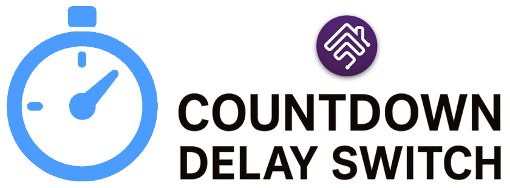

<p align="center">
  
</p>

# Homebridge Delay Countdown Switch

[](https://github.com/homebridge/homebridge/wiki/Verified-Plugins)
[](https://www.npmjs.com/package/homebridge-delay-countdown-switch)
[](https://www.npmjs.com/package/homebridge-delay-countdown-switch)

A Homebridge accessory that acts as a delay switch with countdown timer functionality. The remaining time is displayed in the Apple Home app via a Fan accessory using the RotationSpeed characteristic as a percentage.

## Features

- Switch with configurable delay and units (ms, s, m, h, d)
- Countdown timer updated every second
- Optional sensor (motion/contact/leak/occupancy) triggered at end of delay
- Visual timer display via Fan accessory in HomeKit

## Installation

```bash
npm install -g homebridge-delay-countdown-switch
```

## Example config.json

 ```
    "accessories": [
        {
            "accessory": "DelayCountdownSwitch",
            "name": "Delay Countdown Switch",
            "delay": 30,
            "delayUnit": "s",
            "sensorType": "motion",
            "flipSensorState": false,
            "disableSensor": false,
            "disableTimerDisplay": false,
            "debug": false,
            "startOnReboot": false
        }   
    ]

```

|             Parameter            |         Description         | Required |  Default |   type   |
| -------------------------------- | --------------------------- |:--------:|:--------:|:--------:|
| `accessory`             | always `"DelayCountdownSwitch"`               |     ✓    |     -    |  String  |
| `name`                  | Name for your accessory              |     ✓    |     -    |  String  |
| `delay`                 |  Delay/Timer time. 0 - timer disabled |     ✓    |     0    |  Integer |
| `delayUnit`             |  Delay Time Unit: ms / s / m / h / d |     ✓    |     "ms"    |  String |
| `sensorType`            |  The sensor type that will trigger when the time has ended (`null` for no sensor)         |         | `motion` |  String |
| `flipSensorState`       | Flips the trigger sensor state (close/open, detected/not detected)   |          |   `false`  |  Boolean |
| `disableSensor`         | Disables the associated sensor |        | `false` | Boolean |
| `disableTimerDisplay`   | Disables the associated countdown fan |       | `false` | Boolean |
| `startOnReboot`         | When set to `true`, the switch will be turned ON and start the timer when Homebridge restarts        |       |  `false` |  Boolean  |


## Support homebridge-delay-countdown-switch

**homebridge-delay-countdown-switch** is a free plugin under the MIT license. it was developed as a contribution to the homebridge/hoobs community with lots of love and thoughts.
Creating and maintaining Homebridge plugins consume a lot of time and effort and if you would like to share your appreciation, feel free to "Star" or donate.

[](https://www.paypal.me/apogeorgiadis)

## Acknowledgments

This plugin is a derived work based on [homebridge-delay-switch](https://github.com/nitaybz/homebridge-delay-switch) by [Nitay B](https://github.com/nitaybz), licensed under the MIT License.
